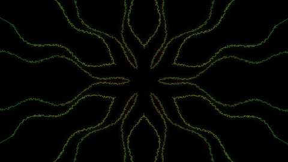
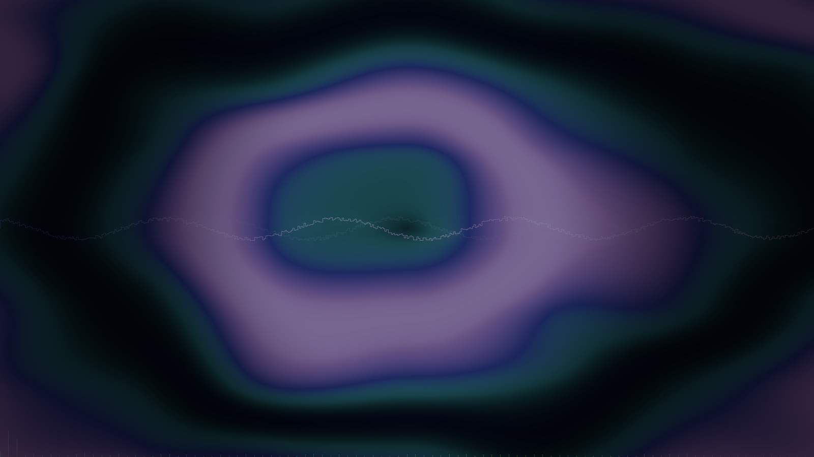
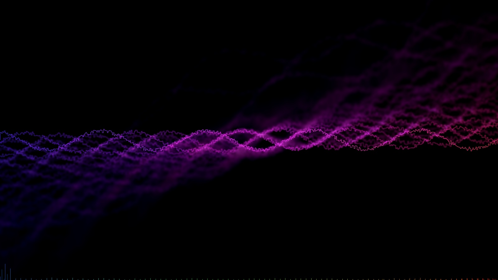
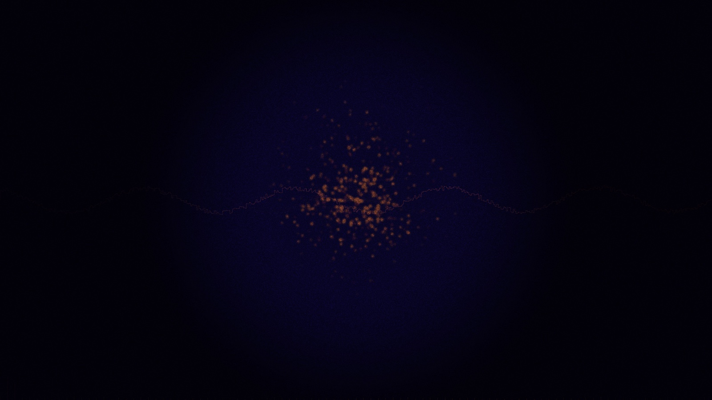
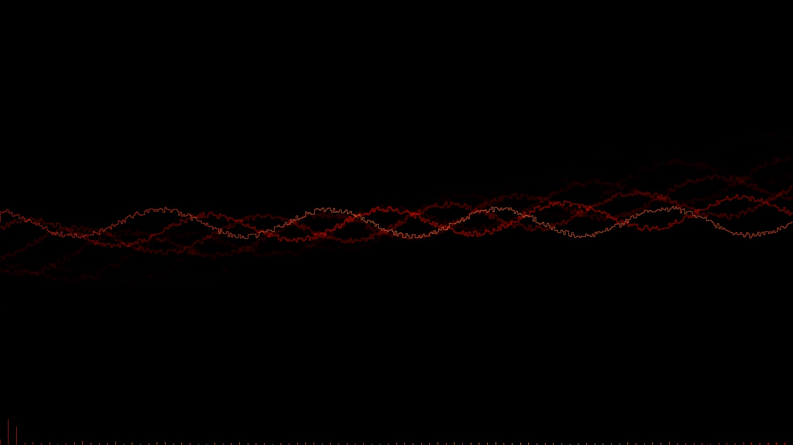
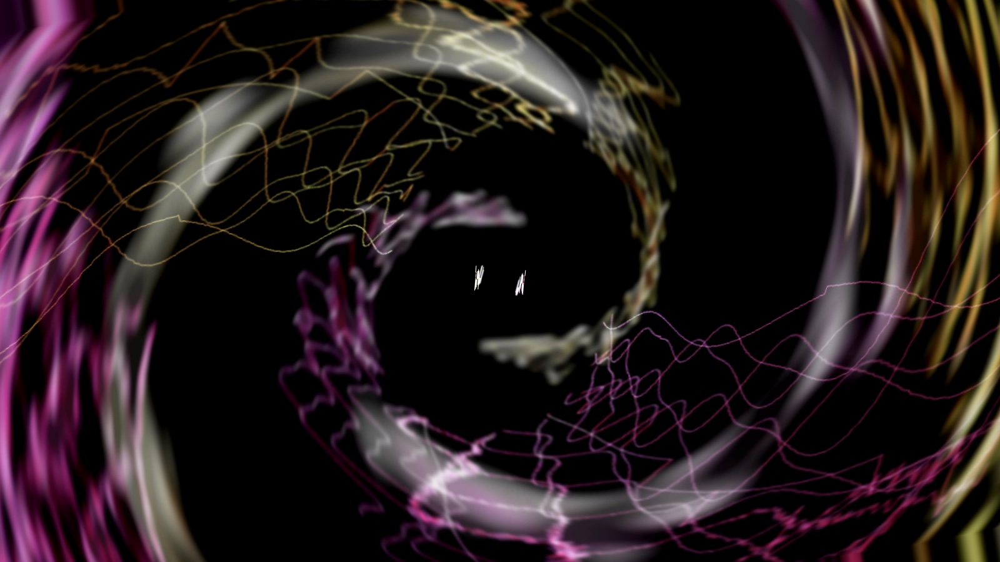
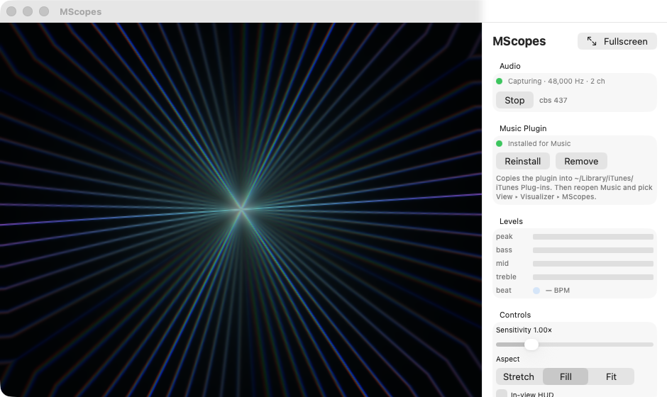

# MScopes

**Real-time music visualizer for macOS.** It listens to whatever the Mac is
playing — Apple Music, Spotify, a browser, a DAW — through a system audio
tap, so it reacts to the digital signal itself: at any volume, on headphones,
on speakers. It plays the classic **AVS** preset language of the Winamp era
faithfully and adds a modern GPU effect layer on the same engine. An Apple
Music visualizer plugin ships inside the app.

<p align="center"></p>

**Download:** [mscopes.com](https://mscopes.com) — a signed, notarized DMG
(macOS 14.4 or later, Apple silicon and Intel). **Source:** this repository,
BSD 3-Clause.

## What it does

- **System audio in.** No cables, no loopback drivers: a CoreAudio process
  tap captures the mix the Mac is playing. First launch asks once for
  permission.
- **Classic AVS presets, faithfully.** The complete component set — nested
  Effect Lists with every blend mode, Superscope, Dynamic Movement / Shift /
  Distance Modifier, Color Modifier, Texer II, Triangle, Global Variables,
  Buffer Save, Set Render Mode, Custom BPM, the common APEs — running on our
  own EEL virtual machine. Line modes, 8-bit truncation and list persistence
  are reproduced, so decades-old presets look the way they did. Over a
  community archive of 13,440 presets, all but 10 (Windows-only components:
  Text, Picture, video, external DLLs) load and render.
- **Modern effects on the same stack.** Bloom, kaleidoscope, chromatic
  aberration, shockwave, glitch, anamorphic streaks, lens, radial blur, edge
  glow, duotone, heat shimmer, CRT, tone mapping, vignette — and
  `pixel_shader`: EEL scripts transpiled to Metal and run per pixel.
- **A GPU engine.** Zero-copy Metal backend over the framebuffer's own memory,
  deferred command buffers, the hot classic effects ported to compute kernels
  with the CPU loops as fallback. A steady 60 fps, paced by the display.
- **Beat detection.** Energy-flux onsets, BPM estimate and beat phase from the
  live signal, exposed to scripts the way AVS presets expect.
- **Apple Music plugin.** A visualizer inside Music, installed with one click
  from the app. Today it runs the bar/waveform renderer with the shared beat
  detector; the preset engine is linked in but not yet routed to it.
- **Preset browser, albums, script editor, macro knobs.** Point the app at
  your `.avs` library: every preset is listed and searchable, numbered
  sequences become albums that play in order.
- **A headless renderer.** `vizrender` turns a preset and a WAV into PNG
  frames, and builds with CMake on any platform — it is how the engine is
  tested, and how the pictures below were made.

## Gallery

Built-in presets, rendered by the engine:

<table><tr>
<td></td>
<td></td>
<td></td>
</tr><tr>
<td></td>
<td></td>
<td></td>
</tr><tr>
<td></td>
<td></td>
<td></td>
</tr></table>

Presets from the Winamp era, unmodified `.avs` files played by MScopes
(the work of their authors — Justin Frankel, lone, and others — and not
part of this repository):

<table><tr>
<td></td>
<td></td>
<td></td>
</tr><tr>
<td></td>
<td></td>
<td></td>
</tr></table>

The app, with its sidebar:

<p align="center"></p>

## Presets

MScopes ships with its own presets. The thousands of community `.avs`
presets from the Winamp era are content you bring: pick a library folder in
the app and every `.avs` underneath is listed. Where to find packs, how
albums work, and why some presets are black on their own:
[docs/PRESETS.md](docs/PRESETS.md).

## Building

The engine, the headless renderer and the self-tests need a C++17 compiler
and CMake, on any platform:

    tools/run-tests.sh                       # configure, build, run every test
    build/cmake/vizrender presets/tests/05-set-render-mode.avs --audio song.wav --out frames
    build/cmake/vizrender --list             # built-in presets; --builtin "<name>" renders one

The macOS app and the Music plugin are one XcodeGen project:

    brew install xcodegen cmake
    cd apple && xcodegen generate
    xcodebuild -project MScopes.xcodeproj -scheme App -configuration Debug \
               -destination 'generic/platform=macOS' build

Building `App` also builds the plugin and embeds it; the app's **Install…**
button copies it into `~/Library/iTunes/iTunes Plug-ins/` for Music. Notes on
targets and dev aids: [apple/README.md](apple/README.md). Signing,
notarization and the release DMG: [docs/SIGNING.md](docs/SIGNING.md).

## Layout

```
core/                   the portable engine (plain C++; CMake builds it anywhere)
  effects/ script/      effect library + EEL VM and the EEL→MSL transpiler
  preset/               .avs (classic) and JSON preset loaders
  audio/                Analyzer (FFT → VizFrame) + BeatDetector
  gpu/                  GpuFx.h backend interface; metal/ implementation; a stub elsewhere
  platform/             the porting seams: fft, page memory, PNG output
  tests/ tools/         self-tests; vizrender
apple/                  one XcodeGen project: VizCore lib, the macOS App, the Music plugin
presets/tests/          the repo's own .avs fixtures (tools/make-test-presets.py)
tools/                  run-tests.sh, release.sh, preset archive helpers
docs/                   PRESETS.md, SIGNING.md, media/
CMakeLists.txt          engine + tools + tests, every platform
```

The engine has no Apple dependency outside `core/platform/` and
`core/gpu/metal/`; a Windows or Linux front-end would sit beside `apple/`.

## Credits and license

BSD 3-Clause (`LICENSE`). MScopes is a fresh project, not a fork of the Winamp
source tree. Its classic effects are re-implementations of the algorithms in
the open-sourced `vis_avs`, credited in [NOTICE.md](NOTICE.md) together with
Apple's iTunes Visual SDK. "Winamp", "Nullsoft" and "AVS" are the marks of
their owners; MScopes is not affiliated with or endorsed by them.
